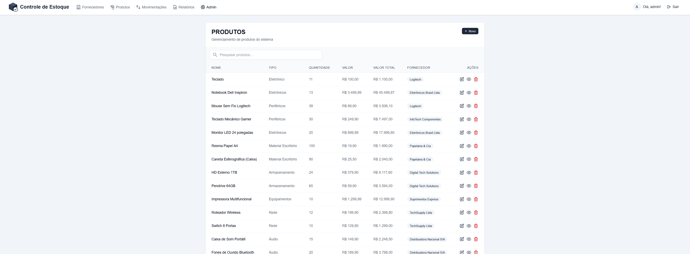

# Sistema de Controle de Estoque

Um aplicativo web completo desenvolvido em ASP.NET Core Razor Pages para controle de estoque, movimentação de produtos e geração de relatórios.

## Tecnologias Utilizadas

- .NET 8
- ASP.NET Core Razor Pages
- Entity Framework Core
- SQL Server
- Tailwind CSS
- Identity para autenticação e autorização

## Funcionalidades

- Gestão de produtos e fornecedores
- Controle de estoque com níveis de segurança
- Registro de movimentações (entradas/saídas)
- Relatórios personalizáveis
- Sistema de permissões baseado em perfis
- Interface moderna e responsiva

## Como executar o projeto

1. Clone este repositório
2. Configure a string de conexão no arquivo appsettings.json
3. Execute as migrations: `dotnet ef database update`
4. Execute o projeto: `dotnet run`

## Credenciais para teste

O sistema possui três níveis de acesso para demonstração:

- **Administrador**: 
  - Email: admin@localhost
  - Senha: Admin#1234

- **Gerente**: 
  - Email: gerente@localhost
  - Senha: Gerente#1234

- **Usuário**: 
  - Email: usuario@localhost
  - Senha: Estoque#1234

Cada nível possui permissões diferentes para demonstrar o controle de acesso baseado em perfis.

## Screenshots

Esta seção apresenta as principais telas do Sistema de Controle de Estoque desenvolvido com Razor Pages e .NET 8.

### Dashboard e Administração

O sistema oferece painéis administrativos intuitivos para monitoramento e gestão:

### Gestão de Produtos

Interface completa para o gerenciamento do catálogo de produtos:

### Movimentação de Estoque

Ferramentas para o controle preciso da entrada e saída de mercadorias:

### Fornecedores

Gestão completa de fornecedores para otimizar a cadeia de suprimentos:

### Relatórios

Sistema avançado de relatórios para análise de dados e tomada de decisões:

### Autenticação

Sistema seguro de login e registro para proteção dos dados:

## O que aprendi

Este projeto foi desenvolvido como parte do meu portfólio para demonstrar minhas habilidades em desenvolvimento web com .NET. Os principais desafios e aprendizados incluíram:

- Implementação de autenticação e autorização com Identity
- Construção de relatórios dinâmicos
- Design de interface usando Tailwind CSS
- Boas práticas de programação e segurança
